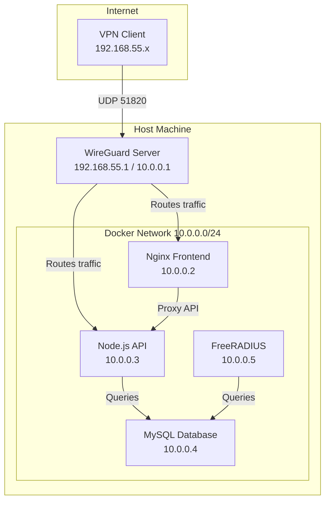

# G-Radius Network Architecture

## Overview

G-Radius uses a dual-network architecture for enhanced security and flexibility:

1. **Docker Internal Network** (`10.0.0.0/24`) - For service-to-service communication
2. **WireGuard VPN Network** (`192.168.55.0/24`) - For VPN client connections

## Network Topology



## Network Details

### WireGuard VPN Network: `192.168.55.0/24`

- **Gateway**: `192.168.55.1` (WireGuard server)
- **DNS**: `192.168.55.1`
- **Client IP Range**: `192.168.55.10` - `192.168.55.253`
- **Purpose**: VPN client connections

**Exposed Port:**
- UDP `51820` - WireGuard VPN (ONLY port exposed to internet)

### Docker Internal Network: `10.0.0.0/24`

- **Gateway**: `10.0.0.254`
- **Service IPs**:
  - `10.0.0.1` - WireGuard (internal interface)
  - `10.0.0.2` - Nginx Frontend
  - `10.0.0.3` - Backend API
  - `10.0.0.4` - MySQL Database
  - `10.0.0.5` - FreeRADIUS

**No Exposed Ports** - All services accessible only via VPN

## Routing Configuration

### Inter-Network Routing

The WireGuard container is configured to route traffic between both networks:

1. **IP Forwarding**: Enabled via sysctls
   ```yaml
   sysctls:
     - net.ipv4.ip_forward=1
     - net.ipv4.conf.all.forwarding=1
   ```

2. **iptables NAT Rules**:
   ```bash
   # Allow forwarding between networks
   iptables -A FORWARD -i wg0 -o eth0 -j ACCEPT
   iptables -A FORWARD -i eth0 -o wg0 -j ACCEPT
   
   # NAT for VPN clients accessing Docker network
   iptables -t nat -A POSTROUTING -s 192.168.55.0/24 -d 10.0.0.0/24 -j MASQUERADE
   ```

3. **Client Configuration**:
   ```ini
   [Interface]
   Address = 192.168.55.x/32
   DNS = 192.168.55.1
   
   [Peer]
   AllowedIPs = 192.168.55.0/24, 10.0.0.0/24
   ```

## Traffic Flow

### 1. VPN Client → Frontend
```
Client (192.168.55.x) 
  → WireGuard (192.168.55.1) 
  → Routes to (10.0.0.2) 
  → Nginx Frontend
```

### 2. VPN Client → Backend API
```
Client (192.168.55.x) 
  → WireGuard (192.168.55.1) 
  → Routes to (10.0.0.3) 
  → Backend API
```

### 3. Frontend → Backend
```
Nginx (10.0.0.2) 
  → Proxy to (10.0.0.3:5000) 
  → Backend API
```

### 4. Backend → Database
```
Backend (10.0.0.3) 
  → Direct connection to (10.0.0.4:3306) 
  → MySQL
```

## Security Features

### Network Isolation

1. **Zero External Exposure**: Only WireGuard port (51820/UDP) is exposed
2. **VPN-Only Access**: All services require VPN connection
3. **Network Segmentation**: Separate networks for VPN and services

### Access Control

1. **Rate Limiting**: 
   - Global: 100 requests/15min per IP
   - Auth endpoints: 5 attempts/15min per IP
   - API endpoints: 30 requests/second per IP

2. **Firewall Rules**:
   - Only established connections allowed
   - Stateful packet inspection via iptables

### Encryption

1. **WireGuard**: ChaCha20-Poly1305 encryption
2. **Database**: Encrypted connections (optional)
3. **JWT Tokens**: HS256 signing

## Troubleshooting

### Cannot Access Services from VPN

1. **Check VPN Connection**:
   ```bash
   wg show
   ```

2. **Verify Routing**:
   ```bash
   # From VPN client
   ping 192.168.55.1  # WireGuard server
   ping 10.0.0.2      # Frontend
   ping 10.0.0.3      # Backend
   ```

3. **Check AllowedIPs**:
   Ensure client config includes both networks:
   ```ini
   AllowedIPs = 192.168.55.0/24, 10.0.0.0/24
   ```

### Services Cannot Communicate

1. **Check Docker Network**:
   ```bash
   docker network inspect gradius_vpn_network
   ```

2. **Verify Container IPs**:
   ```bash
   docker inspect -f '{{range .NetworkSettings.Networks}}{{.IPAddress}}{{end}}' gradius-backend
   ```

3. **Check Logs**:
   ```bash
   docker-compose logs wireguard
   docker-compose logs backend
   ```

### Routing Not Working

1. **Verify IP Forwarding**:
   ```bash
   docker exec gradius-wireguard sysctl net.ipv4.ip_forward
   # Should return: net.ipv4.ip_forward = 1
   ```

2. **Check iptables Rules**:
   ```bash
   docker exec gradius-wireguard iptables -t nat -L -n -v
   docker exec gradius-wireguard iptables -L FORWARD -n -v
   ```

3. **Verify Routes**:
   ```bash
   docker exec gradius-wireguard ip route show
   ```

## Performance Considerations

### Network Overhead

- **WireGuard**: ~4% overhead (very efficient)
- **Docker Bridge**: Minimal overhead (<1%)
- **NAT**: Negligible impact

### Optimization Tips

1. **MTU Settings**: Adjust if experiencing fragmentation
   ```ini
   [Interface]
   MTU = 1420
   ```

2. **Connection Pooling**: Backend uses connection pooling (10 connections)

3. **Keep-Alive**: WireGuard keep-alive set to 25 seconds

## Migration from 10.0.0.0/24

If migrating from the old single-network setup:

1. **Backup Existing Configs**:
   ```bash
   docker-compose down
   cp -r wireguard_config wireguard_config.backup
   ```

2. **Update Environment**:
   ```bash
   # Update .env with new WG_NETWORK
   WG_NETWORK=192.168.55.0/24
   ```

3. **Regenerate Peer Configs**:
   - All existing VPN clients need new configurations
   - Generate via dashboard or API

4. **Deploy**:
   ```bash
   docker-compose up -d
   ```

## Additional Resources

- [WireGuard Documentation](https://www.wireguard.com/)
- [Docker Networking](https://docs.docker.com/network/)
- [iptables Tutorial](https://www.netfilter.org/documentation/)
